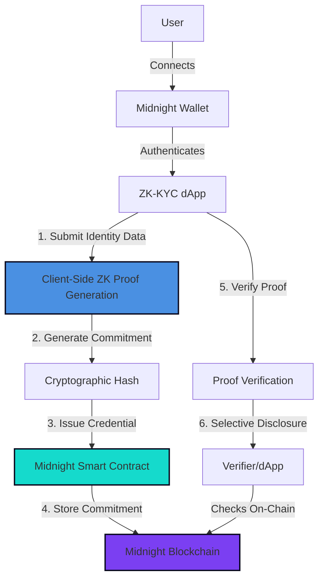

# ZK-KYC dApp

> Privacy-preserving KYC verification on the Midnight Network using zero-knowledge proofs.

**🏆 1st Place Winner** at the [Midnight Hackathon Buenos Aires](https://github.com/joacolinares/kyc-midnight) (August 2025, IOHK / Cardano Foundation) with team Blockenfy.

---

## Table of Contents

- [Overview](#overview)
- [Problem & Solution](#problem--solution)
- [How It Works](#how-it-works)
- [Tech Stack](#tech-stack)
- [Project Structure](#project-structure)
- [Getting Started](#getting-started)
- [Environment Variables](#environment-variables)
- [Contract Deployment](#contract-deployment)
- [Features](#features)
- [Status & Roadmap](#status--roadmap)
- [License](#license)

---

## Overview

This dApp enables users to prove their identity attributes (age, country, liveness) using **zero-knowledge proofs** on the Midnight Network—without revealing underlying personal data. The system issues on-chain credentials backed by cryptographic commitments, allowing selective disclosure for compliance use cases.

This repository builds upon the [original hackathon codebase](https://github.com/joacolinares/kyc-midnight) developed by Kevin Anrique and team Blockenfy.

---

## Problem & Solution

**Problem:**  
Traditional KYC systems require users to share sensitive personal data (full name, date of birth, document scans) with every service provider, creating privacy risks and data silos.

**Solution:**  
ZK-KYC leverages zero-knowledge proofs to let users:
- Prove they are **over 18** without revealing their exact age
- Prove they are **from a specific country** without disclosing their full address
- Prove they are **human** (liveness + CAPTCHA) without storing biometric data on-chain

All credentials are stored as cryptographic commitments on the Midnight blockchain, ensuring privacy while meeting regulatory requirements.

---

## How It Works



### Workflow

1. **Wallet Connection:** User connects their Midnight wallet to the dApp
2. **Identity Submission:** User provides identity attributes (age bracket, country, liveness)
3. **ZK Proof Generation:** Client-side proof generation creates cryptographic commitments
4. **On-Chain Credential Issuance:** Smart contract stores commitments (not raw data) on Midnight blockchain
5. **Proof Verification:** Verifiers can check proofs without seeing underlying data
6. **Selective Disclosure:** Users share only what's needed (e.g., "I am over 18")

---

## Tech Stack

### Frontend
- **Next.js** 16.0.0 (App Router)
- **React** 19.2.0
- **TypeScript** 5.x
- **Tailwind CSS** 4.1.9 (with Radix UI components)

### Blockchain & ZK
- **Midnight Network** (Cardano sidechain for privacy-preserving smart contracts)
- **Midnight.js SDK** 2.0.2 (contracts, indexer, proof provider)
- **Compact Language** 0.26.0 (ZK smart contract DSL)
- **Midnight Wallet SDK** 5.0.0

### State Management & Storage
- **Zustand** (global state)
- **Level DB** (contract private state)

---

## Project Structure

```
zkkyc-dapp/
├── app/                          # Next.js App Router
│   ├── api/
│   │   ├── kyc/                  # KYC API endpoints
│   │   │   ├── status/           # Check on-chain credential status
│   │   │   ├── verify-proof/     # Verify ZK proofs
│   │   │   ├── store-proof/      # Store proofs server-side
│   │   │   ├── age/              # Age verification flow
│   │   │   ├── country/          # Country verification flow
│   │   │   ├── human/            # Human verification flow
│   │   │   ├── identity/         # Identity verification flow
│   │   │   └── revoke/           # Credential revocation
│   │   └── midnight-indexer/     # Midnight blockchain indexer
│   ├── verify/
│   │   ├── identity/             # Identity verification UI
│   │   ├── age/                  # Age verification UI
│   │   └── human/                # Human verification UI
│   ├── credentials/              # View issued credentials
│   └── page.tsx                  # Homepage (credential dashboard)
├── components/
│   ├── ui/                       # Reusable UI components (Radix-based)
│   ├── credential-card.tsx       # Credential display component
│   ├── auth-guard.tsx            # Wallet authentication guard
│   └── navbar.tsx                # Navigation bar
├── contracts/
│   └── kyc_credentials/          # Midnight smart contract
│       ├── contracts/
│       │   └── kyc-credentials.compact  # Compact ZK contract
│       ├── src/
│       │   ├── deploy.ts         # Deployment script
│       │   ├── contract-client.ts # Contract interaction client
│       │   └── cli.ts            # CLI tool for contract ops
│       └── package.json          # Contract dependencies
├── lib/
│   ├── midnight-client.ts        # Midnight SDK wrapper
│   ├── zk-proof-utils.ts         # ZK proof generation/verification
│   ├── blockchain-utils.ts       # On-chain interaction utilities
│   ├── store.ts                  # Zustand state management
│   ├── proof-store.ts            # Server-side proof storage
│   └── types.ts                  # TypeScript types
├── public/                       # Static assets
├── .env.example                  # Environment variable template
└── package.json                  # Root dependencies
```

---

## Getting Started

### Prerequisites

- **Node.js** >= 20.9.0
- **pnpm** >= 9.0.0
- **Docker** (for local proof server, optional)
- **Midnight Wallet** browser extension ([download here](https://midnight.network/wallet))

### Installation

1. **Clone the repository:**

   ```bash
   git clone https://github.com/yourusername/zkkyc-dapp.git
   cd zkkyc-dapp
   ```

2. **Install dependencies:**

   ```bash
   pnpm install
   ```

   *Note: This runs a postinstall script (`scripts/fix-native-bindings.sh`) to fix Midnight SDK native bindings.*

3. **Set up environment variables:**

   ```bash
   cp .env.example .env.local
   ```

   Edit `.env.local` and add your `NEXT_PUBLIC_MIDNIGHT_CONTRACT_ADDRESS` (see [Contract Deployment](#contract-deployment) below).

4. **Deploy the Midnight smart contract** (if not already deployed):

   ```bash
   cd contracts/kyc_credentials
   npm install
   npm run setup
   ```

   This compiles the Compact contract, builds TypeScript, and deploys to the Midnight testnet. The deployed contract address will be saved in `contracts/kyc_credentials/deployment.json`.

   **Important:** Copy the `contractAddress` from `deployment.json` and add it to your `.env.local` as `NEXT_PUBLIC_MIDNIGHT_CONTRACT_ADDRESS`.

5. **Run the development server:**

   ```bash
   cd ../..  # Return to root directory
   pnpm dev
   ```

   The app will be available at [http://localhost:3000](http://localhost:3000).

### Known Issues

- **Build Warnings:** The project sets `typescript.ignoreBuildErrors: true` in `next.config.mjs` due to some Midnight SDK type conflicts. This does not affect runtime behavior.
- **WebAssembly:** The app requires `syncWebAssembly` support in webpack (configured in `next.config.mjs`).
- **Proof Server:** ZK proof generation uses a remote proof server by default (`NEXT_PUBLIC_MIDNIGHT_PROOF_SERVER`). For local development, run `docker run -p 6300:6300 midnightnetwork/proof-server` and update the env var to `http://127.0.0.1:6300`.

---

## Environment Variables

Copy `.env.example` to `.env.local` and configure the following:

| Variable | Required | Description | Default |
|----------|----------|-------------|---------|
| `NEXT_PUBLIC_MIDNIGHT_CONTRACT_ADDRESS` | ✅ | Deployed contract address on Midnight testnet | (none) |
| `NEXT_PUBLIC_MIDNIGHT_INDEXER_HTTP` | ✅ | Midnight indexer HTTP endpoint | `https://indexer.testnet-02.midnight.network/api/v1/graphql` |
| `NEXT_PUBLIC_MIDNIGHT_INDEXER_WS` | ✅ | Midnight indexer WebSocket endpoint | `wss://indexer.testnet-02.midnight.network/api/v1/graphql/ws` |
| `NEXT_PUBLIC_MIDNIGHT_PROOF_SERVER` | ✅ | ZK proof server URL | `https://lace-dev.proof-pub.stg.midnight.tools` |
| `NEXT_PUBLIC_MIDNIGHT_NETWORK_ID` | ✅ | Network identifier | `TestNet` |
| `NEXT_PUBLIC_MIDNIGHT_EXPLORER_URL` | ❌ | Block explorer URL (for tx links) | `https://explorer.testnet.midnight.network` |
| `NEXT_PUBLIC_ASSET_APP_URL` | ❌ | Asset dApp URL (if integrating with another app) | (none) |
| `ASSET_APP_ORIGIN` | ❌ | Asset dApp origin for CORS | (none) |

**Contract Deployment Variables** (in `contracts/kyc_credentials/.env`):

| Variable | Description | Default |
|----------|-------------|---------|
| `WALLET_SEED` | 64-character wallet seed (auto-generated on first deploy) | (auto) |
| `MIDNIGHT_NETWORK` | Network to deploy to | `testnet` |
| `PROOF_SERVER_URL` | Proof server for contract deployment | `http://127.0.0.1:6300` |
| `CONTRACT_NAME` | Contract name | `kyc-credentials` |

---

## Contract Deployment

The Midnight smart contract is written in **Compact** (a ZK-friendly DSL) and must be deployed before running the dApp.

### Deploy to Testnet

1. **Navigate to contract directory:**

   ```bash
   cd contracts/kyc_credentials
   ```

2. **Install dependencies:**

   ```bash
   npm install
   ```

3. **Run setup (compile + build + deploy):**

   ```bash
   npm run setup
   ```

   This will:
   - Compile `contracts/kyc-credentials.compact` to TypeScript bindings
   - Build TypeScript to JavaScript
   - Generate a wallet seed (saved in `.env`)
   - Deploy the contract to the Midnight testnet
   - Save deployment info to `deployment.json`

4. **Get testnet tokens** (if deployment fails due to insufficient funds):
   - Run `npm run check-balance` to see your wallet address
   - Visit the [Midnight Faucet](https://midnight.network/test-faucet)
   - Request testnet tokens for your address

5. **Update dApp config:**
   
   Copy the `contractAddress` from `contracts/kyc_credentials/deployment.json` and add it to your root `.env.local`:

   ```bash
   NEXT_PUBLIC_MIDNIGHT_CONTRACT_ADDRESS=<your-contract-address>
   ```

### Contract Scripts

| Command | Description |
|---------|-------------|
| `npm run setup` | Full setup: compile → build → deploy |
| `npm run compile` | Compile Compact contract to TypeScript |
| `npm run build` | Build TypeScript to JavaScript |
| `npm run deploy` | Deploy contract to testnet |
| `npm run cli` | Interactive CLI for contract operations |
| `npm run check-balance` | Check wallet balance |
| `npm run health-check` | Verify contract health on-chain |
| `npm run reset` | Delete compiled artifacts and deployments |
| `npm run clean` | Clean build artifacts |

---

## Features

### 🔐 Credential Types

1. **Identity Verification**
   - Full name and document type collection
   - Country verification (stored as commitment)
   - Issues two on-chain credentials: `Identity` + `Country`

2. **Age Verification**
   - Age bracket selection (Under 18 / Over 18)
   - ZK proof generation for "Over 18" users (proves age ≥ 18 without revealing exact age)
   - Issues `Age` credential with commitment

3. **Human Verification**
   - CAPTCHA challenge
   - Liveness detection via camera
   - Issues `Human` credential with commitment
   - ZK proof proves CAPTCHA passed without revealing the actual result

### 🔒 Privacy Features

- **Zero-Knowledge Proofs:** All sensitive data (age, country, CAPTCHA result) is verified via ZK proofs
- **On-Chain Commitments:** Only cryptographic hashes are stored on-chain, never raw data
- **Selective Disclosure:** Users can prove specific attributes (e.g., "I am over 18") without revealing exact values
- **Server-Side Proof Storage:** Proofs are stored off-chain and can be verified independently

### 🎨 UI/UX

- Modern glassmorphism design with dark theme
- Animated backgrounds and smooth transitions
- Responsive design for mobile/tablet/desktop
- Type-specific color schemes for each credential type
- Real-time wallet connection status

<!-- TODO: Add screenshot of credential dashboard here -->

---

## Status & Roadmap

### Current Status

✅ **Completed:**
- Identity, Age, and Human verification flows
- ZK proof generation and verification
- On-chain credential issuance on Midnight testnet
- Wallet integration (Midnight Wallet SDK)
- Credential revocation
- Basic credential dashboard

### Roadmap

Planned improvements:
- [ ] Add credential expiry and renewal flows
- [ ] Implement multi-verifier support (allow third-party verifiers)
- [ ] Improve proof verification performance
- [ ] Add credential sharing/export (QR codes)
- [ ] Support additional document types (passport, driver's license)
- [ ] Add audit logs for compliance
- [ ] Deploy to Midnight mainnet

---

## License

This project is licensed under the **MIT License**.

---

## Acknowledgments

- **Team Blockenfy** for winning 1st place at the Midnight Hackathon Buenos Aires (August 2025)
- [Midnight Network](https://midnight.network/) for the privacy-preserving blockchain infrastructure
- [IOHK](https://iohk.io/) and [Cardano Foundation](https://cardanofoundation.org/) for supporting the hackathon
- [Radix UI](https://www.radix-ui.com/) for accessible UI components
- [Tailwind CSS](https://tailwindcss.com/) for utility-first styling

---

**Built with 🌙 on the Midnight Network**
