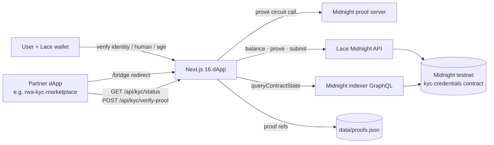

# Midnight ZK-KYC: privacy-preserving KYC on Midnight

> Users prove **identity, humanity and age (18+)** to a Midnight smart contract. Only commitments and proof references go on-chain. The underlying personal data is never published.

This project is built on the Midnight Network.

This repository is a follow-up rebuild (started November 2025) of a hackathon project: a Next.js dApp with a new Compact contract (`kyc-credentials`) and a bridge that lets other dApps consume KYC status. See [Origin / hackathon](#origin--hackathon).

| | |
|---|---|
| **Companion repo** | [rwa-kyc-marketplace](https://github.com/kevan1/rwa-kyc-marketplace): an asset-tokenization marketplace (Cardano) that requires this KYC before it lets you buy |
| **Live demo** | _Not deployed right now._ The Vercel builds fail and the old Railway deployment is gone. See [Deployment](#deployment) |
| **Network** | Midnight **testnet-02** (contract deployed 2025-11-17) |
| **Status** | Hackathon-grade prototype. See [Limitations](#limitations--honest-status) |

---

## Origin / hackathon

I contributed to the project that won **🥇 1st place at Midnight Hackathon Buenos Aires 2025** (August 23–24, 2025).

- Original repo: [joacolinares/kyc-midnight](https://github.com/joacolinares/kyc-midnight)
- My contributions (README, API reference): [kevan1/kyc-midnight-hackathon](https://github.com/kevan1/kyc-midnight-hackathon)

This repository is my follow-up rebuild (November 2025), with a new Compact contract, credential flows and a cross-dApp bridge. Its companion marketplace is [kevan1/rwa-kyc-marketplace](https://github.com/kevan1/rwa-kyc-marketplace).

## Why

Centralised KYC providers cost a lot, and each one ends up holding a honeypot of passports and selfies. The idea is to verify eligibility (age, country, "is human") once, record a **commitment** of that result on Midnight, and let any dApp check it without seeing or storing the raw data.

## Features (verified in code)

- **Lace wallet connection (Midnight).** It detects `window.midnight.mnLace` (with fallbacks) and uses the wallet to balance, prove and submit transactions. An auth guard protects the app routes.
- **Three credential flows**, each ending in an on-chain transaction:
  - **Identity** (`/verify/identity`): pick a country and document type, then enter a document number. The number is checked against a per-country format pattern, and a multi-step verification animation follows. Calls the `registerIdentity` and `issueCountryCredential` circuits.
  - **Human** (`/verify/human`): a camera liveness check (`getUserMedia`, with voice prompts through the Web Speech API) plus a 4-character CAPTCHA. Calls `recordHumanVerification`.
  - **Age** (`/verify/age`): an over-18 / under-18 attestation, unlocked only after identity and human checks pass. Calls `issueAgeCredential`. The ledger stores only a commitment and a proof reference, never the age bracket.
- **Credential wallet** (`/credentials`, `/credentials/[id]`): shows issued credentials, receipts and Midnight explorer links.
- **Issuer portal** (`/issuer`): issue and revoke credentials (`revokeLastCredential`).
- **Ledger hydration**: reads contract state through the Midnight indexer (`queryContractState`) and derives each wallet's KYC status.
- **Cross-dApp bridge** (`/bridge?redirect=…`): an external app sends the user here. Once identity, age and human credentials are all on-chain, the user is redirected back with the KYC result.
- **Verifier API** with a CORS allow-list for partner apps:
  - `GET /api/kyc/status?wallet=`: on-chain credential status
  - `POST /api/kyc/verify-proof`: checks age, country and CAPTCHA proof references against on-chain commitments
  - `POST /api/kyc/store-proof`: server-side proof storage (`data/proofs.json`)
  - `GET /api/midnight/zk-config?circuit=`: serves compiled prover/verifier keys and ZKIR to the browser
- **Mint demo** (`/mint`, `/api/mint`): mints Cardano property tokens through Mesh SDK and Lace. This was carried over from the companion tokenization app.

## Architecture



**Contract** (`contracts/kyc_credentials/contracts/kyc-credentials.compact`): ledger fields hold JSON maps of commitments, proof references and issuers for identity, age, country and human credentials, plus a revocation registry. The circuits are `registerIdentity`, `issueAgeCredential`, `issueCountryCredential`, `recordHumanVerification` and `revokeLastCredential`. A `create-mn-app` based toolkit in `contracts/kyc_credentials/src` handles deploy, CLI, balance and health checks.

## Tech stack

- **Frontend:** Next.js 16.0.0 (App Router, webpack with `syncWebAssembly`), React 19.2, TypeScript, Tailwind CSS 4, Radix UI / shadcn, Zustand, Sonner
- **Midnight:** Compact (`compact compile +0.26.0`, `language_version 0.18`), `@midnight-ntwrk/midnight-js-*` 2.0.2, `compact-runtime` 0.9, `ledger` 4, `zswap` 4, `wallet-api` 5, Lace wallet
- **Cardano (mint demo):** `@meshsdk/core` / `@meshsdk/transaction` 1.9 beta

## Getting started

Prerequisites: Node.js ≥ 20.9 (≥ 22 for the contract toolkit), pnpm ≥ 9, Docker (local proof server), the Compact compiler, and the Lace wallet with Midnight enabled.

```bash
pnpm install          # postinstall runs scripts/fix-native-bindings.sh (macOS quarantine fix; no-op elsewhere)
cp .env.example .env.local
pnpm dev              # http://localhost:3000
pnpm build && pnpm start
```

Deploy your own contract (optional; a testnet-02 address is in `contracts/kyc_credentials/deployment.json`):

```bash
cd contracts/kyc_credentials
npm install
npm run proof-server   # docker: midnightnetwork/proof-server on :6300
npm run setup          # compile (Compact) → tsc → deploy; writes deployment.json
npm run cli            # interact with the deployed contract
```

`/api/midnight/zk-config` serves circuit keys from `contracts/kyc_credentials/contracts/managed/`. That folder is git-ignored, so run `npm run compile` before starting the app.

### Environment variables (names only)

| App (`.env.local`) | Purpose |
|---|---|
| `NEXT_PUBLIC_MIDNIGHT_CONTRACT_ADDRESS` | deployed `kyc-credentials` contract |
| `NEXT_PUBLIC_MIDNIGHT_INDEXER_HTTP`, `NEXT_PUBLIC_MIDNIGHT_INDEXER_WS` | indexer endpoints |
| `NEXT_PUBLIC_MIDNIGHT_PROOF_SERVER` | proof server URL |
| `NEXT_PUBLIC_MIDNIGHT_NETWORK_ID` | `TestNet` / `MainNet` |
| `NEXT_PUBLIC_MIDNIGHT_EXPLORER_URL` | explorer links (optional) |
| `NEXT_PUBLIC_ASSET_APP_URL`, `ASSET_APP_ORIGIN` | partner dApp origin(s) allowed by CORS |

| Contract toolkit (`contracts/kyc_credentials/.env`) | Purpose |
|---|---|
| `WALLET_SEED` | 64-hex deployer wallet seed (**never commit**) |
| `MIDNIGHT_NETWORK`, `PROOF_SERVER_URL`, `CONTRACT_NAME` | deploy settings |

## Deployment

- `railway.json` (Nixpacks) is included. The server writes proofs to local disk (`data/proofs.json`), so it needs a persistent Node host rather than serverless.
- The Vercel projects `kyc-midnight` and `kyc-midnight-1rnc` are linked, but every production build so far has failed (the latest was on 2026-02-17).

## Limitations / honest status

- **The "ZK proofs" for statements are placeholders.** `lib/zk-proof-utils.ts` produces hash-based *proof references* (`zk-proof:<type>:<hash>`). Real Midnight proofs are generated only for the contract-call transactions themselves. The Compact circuits store opaque JSON strings and do not yet enforce `age ≥ 18` or issuer authorisation inside the circuit.
- **Identity, liveness and CAPTCHA checks are demo UX** (pattern checks and timers), not real document or biometric verification.
- The country proof is hard-coded to `country == France` for the companion marketplace demo.
- `typescript.ignoreBuildErrors` is enabled. It targets **testnet-02**, and the Midnight SDK versions are from 2025.
- The `/bridge` redirect accepts any absolute URL. Restrict it to an allow-list before production.

## Credits

- Commit history of this repository: Kevin Anrique ([@kevan1](https://github.com/kevan1)).
- Original hackathon code: [joacolinares/kyc-midnight](https://github.com/joacolinares/kyc-midnight), based on Midnight's bulletin-board example.

## License

No license has been chosen yet. Add one (for example Apache-2.0, as the upstream Midnight example uses) before inviting reuse.
